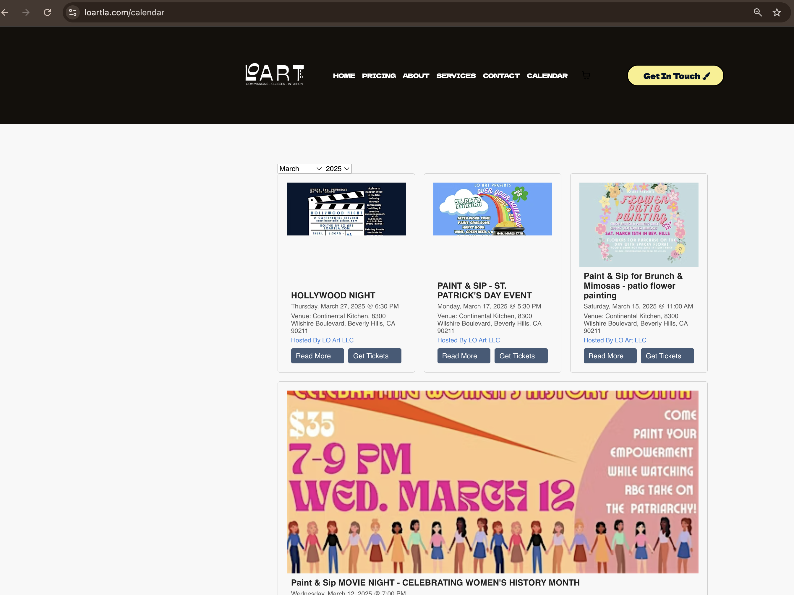
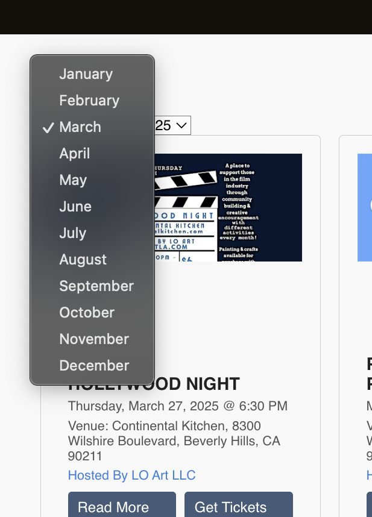
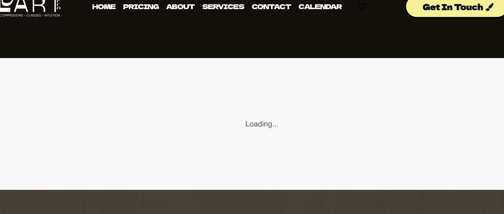

# EmbedBrite

A simple way to embed an Eventbrite event feed into your website.

## Features

*   Displays a live Eventbrite event feed.
*   Offers options to filter events by year and month.
*   Includes a loading screen to improve user experience while the API is called.

## Screenshots

This is a live example of the EmbedBrite widget.

The widget allows users to filter events by year and month.

The widget includes a loading screen to provide feedback while events are being fetched.

## Setup

1.  Download the project files.
2.  **Important:** Replace the placeholder API token in the JavaScript code with your own Eventbrite API token. You can obtain an API token from the [Eventbrite Developer Portal](https://www.eventbrite.com/platform/api/).
3.  Customize the filtering options (year, month) as needed.
4.  Embed the code into your website.

## Usage

Include the necessary HTML and JavaScript files in your website.  Refer to the example files for guidance on integration.

## License

This project is licensed under the Creative Commons Attribution-NonCommercial 4.0 International License - see [https://creativecommons.org/licenses/by-nc/4.0/](https://creativecommons.org/licenses/by-nc/4.0/) for details.

You are free to:

*   **Share** — copy and redistribute the material in any medium or format
*   **Adapt** — remix, transform, and build upon the material

Under the following terms:

*   **Attribution** — You must give appropriate credit, provide a link to the license, and indicate if changes were made. You may do so in any reasonable manner, but not in any way that suggests the licensor endorses you or your use.
*   **NonCommercial** — You may not use the material for commercial purposes.

## Contributing

Contributions are welcome! Feel free to submit pull requests with improvements or bug fixes.